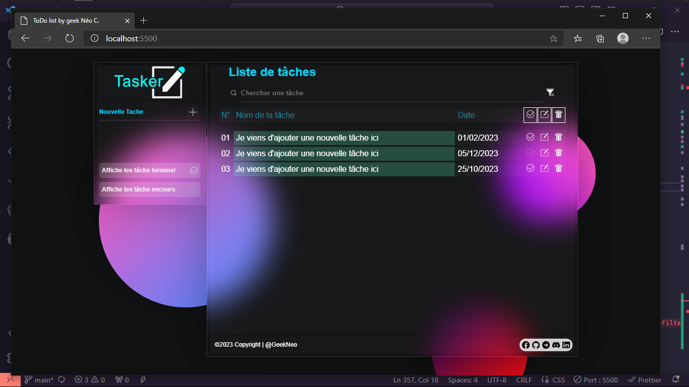

# Tâche a Faire : Version 0.1
@autor: N30-Geek !
____
### Comment faire pour ajouté du javaScript

1. Aller dans le dossier ./Ressources/scripts/
2. Dans le fichier App.js

#### Description de référencement de selecteurs
>Vous pouvez ajouter des id dans les balises conserner pour les evenements des actions
____

#### Exemple d'UI /

